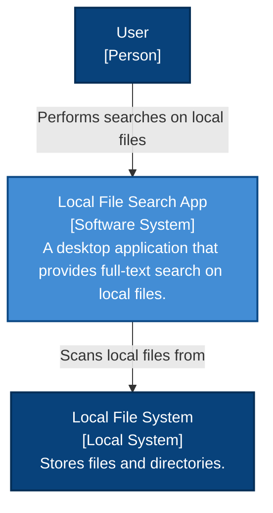
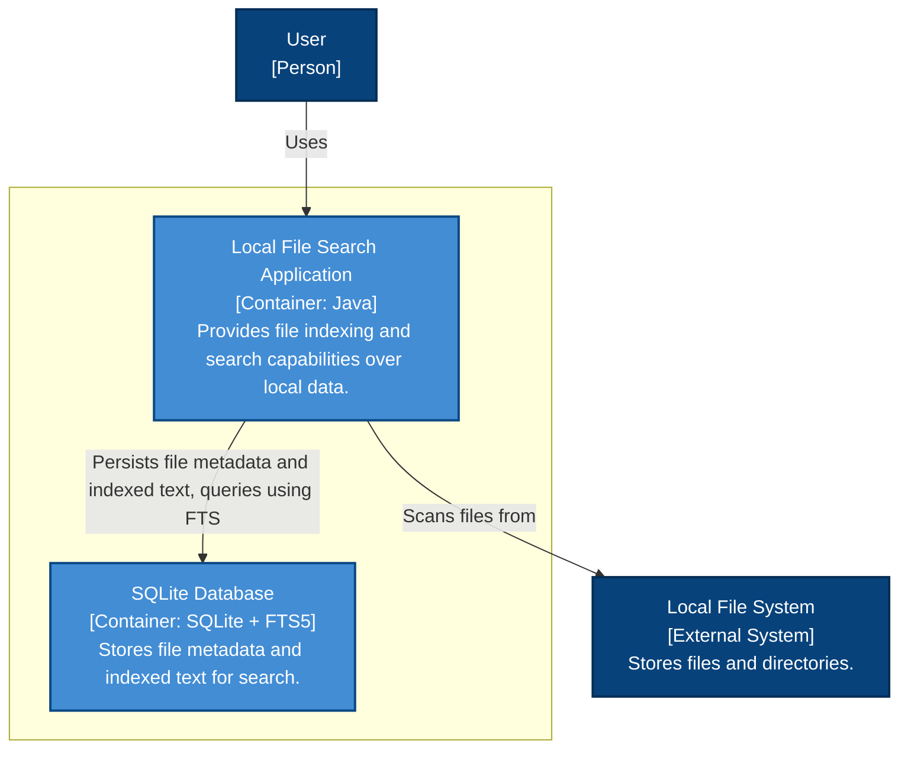
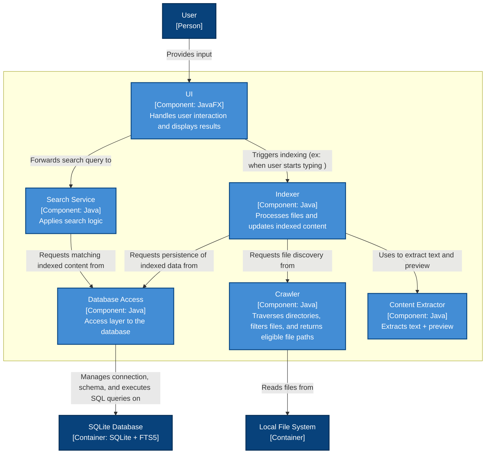

## [Level 1]: System Context

```mermaid
graph TD
    User["User<br/>[Person]<br/>"]
    App["Local File Search App<br/>[Software System]<br/>A desktop application that provides full-text search on local files."]
    FS["Local File System<br/>[Local System]<br/>Stores files and directories."]


    User -->|Performs searches on local files| App
    App -->|Scans local files from| FS

    classDef person fill:#08427b,color:#ffffff,stroke:#052e56,stroke-width:2px;
    classDef system fill:#438dd5,color:#ffffff,stroke:#0b4884,stroke-width:2px;
    classDef local fill:#08427b,color:#ffffff,stroke:#052e56,stroke-width:2px;

    class User person;
    class App system;
    class FS local;
```

## [Level 2]: Containers

```mermaid
graph TD
User["User<br/>[Person]<br/>"]

    FS["Local File System<br/>[External System]<br/>Stores files and directories."]

    subgraph AppSystem[" "]
        App["Local File Search Application<br/>[Container: Java]<br/>Provides file indexing and search capabilities over local data."]
        DB["SQLite Database<br/>[Container: SQLite + FTS5]<br/>Stores file metadata and indexed text for search."]
    end

    User -->|Uses| App
    App -->|Scans files from| FS
    App -->|Persists file metadata and indexed text, queries using FTS| DB

    classDef person fill:#08427b,color:#ffffff,stroke:#052e56,stroke-width:2px;
    classDef system fill:#438dd5,color:#ffffff,stroke:#0b4884,stroke-width:2px;
    classDef external fill:#08427b,color:#ffffff,stroke:#052e56,stroke-width:2px;
    classDef database fill:#438dd5,color:#ffffff,stroke:#0b4884,stroke-width:2px;

    class User person;
    class App system;
    class FS external;
    class DB database;
```

## [Level 3]: Components

```mermaid
graph TD
    %% External
    User["User<br/>[Person]<br/>"]
    FS["Local File System<br/>[Container]"]
    DB["SQLite Database<br/>[Container: SQLite + FTS5]"]

    %% Application boundary
    subgraph App[" "]

        UI["UI<br/>[Component: JavaFX]<br/>Handles user interaction and displays results"]

        %% Search (top-down)
        Search["Search Service<br/>[Component: Java]<br/>Applies search logic"]
        DBAccess["Database Access<br/>[Component: Java]<br/>Access layer to the database"]

        %% Indexing pipeline (top-down)
        Crawler["Crawler<br/>[Component: Java]<br/>Traverses directories, filters files, and returns eligible file paths"]
        Extractor["Content Extractor<br/>[Component: Java]<br/>Extracts text + preview"]
        Indexer["Indexer<br/>[Component: Java]<br/>Processes files and updates indexed content"]

    end

    %% User interaction
    User -->|"Provides input"| UI

    %% Search flow (vertical)
    UI -->|"Forwards search query to"| Search
    Search -->|"Requests matching indexed content from"| DBAccess
   

    %% Indexing flow (vertical, separate lane)
    UI -->|"Triggers indexing (ex: when user starts typing )"|Indexer
    Indexer -->|"Requests file discovery from"| Crawler
    Indexer -->|"Uses to extract text and preview"| Extractor
    Indexer -->|"Requests persistence of indexed data from"| DBAccess

    %% External connections
    Crawler -->|"Reads files from"| FS
    DBAccess -->|"Manages connection, schema, and executes SQL queries on"| DB

    %% Styles
    classDef person fill:#08427b,color:#ffffff,stroke:#052e56,stroke-width:2px;
    classDef system fill:#438dd5,color:#ffffff,stroke:#0b4884,stroke-width:2px;
    classDef local fill:#08427b,color:#ffffff,stroke:#052e56,stroke-width:2px;

    class User person;
    class UI,Search,Crawler,Extractor,Indexer,DBAccess system;
    class FS,DB local;
```

## [Level 4]: UML Class Diagrams