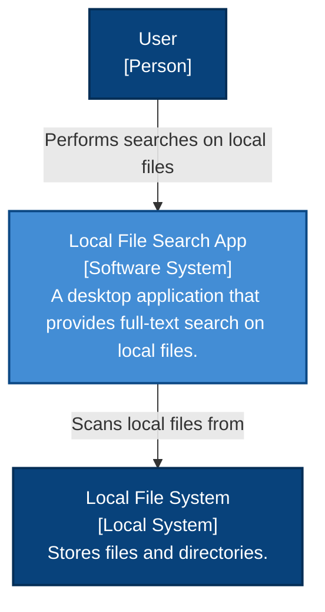
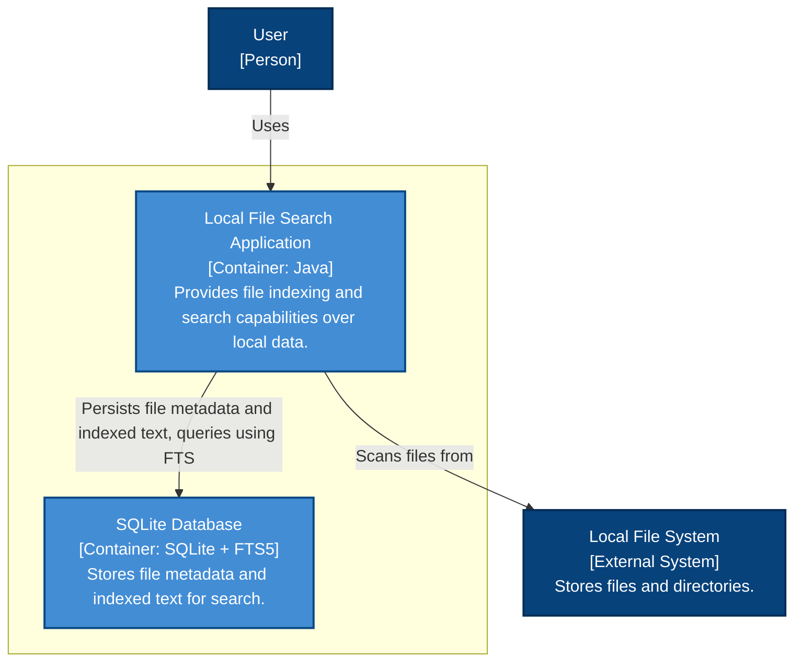
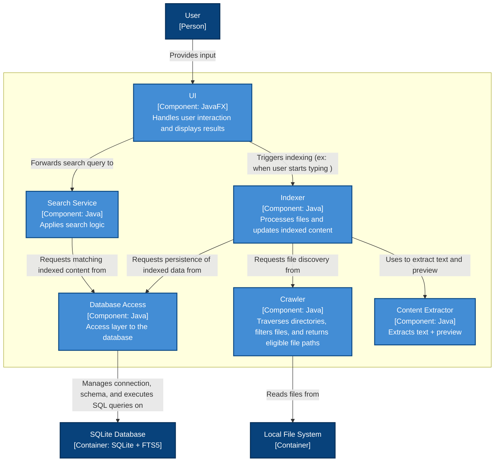
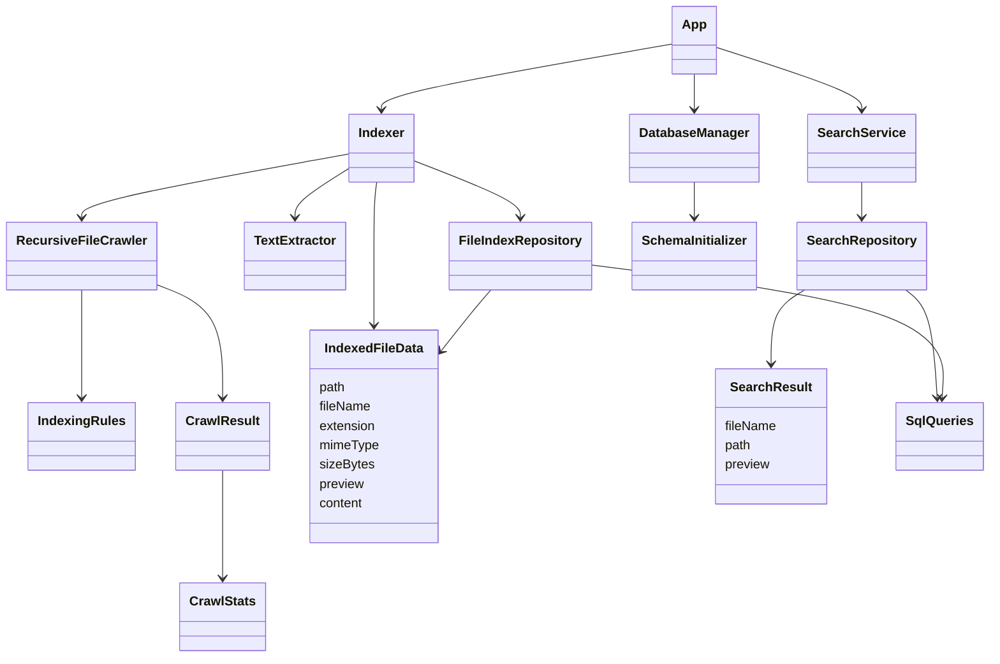

# Architecture Overview

This document describes the architecture of the local file search engine using the **C4 model**.
The diagrams move from the overall system view to the internal implementation structure, showing how file crawling, indexing, persistence, and search are organized.

## [Level 1]: System Context
The System Context diagram shows the application in its **environment**, focusing on the user and the external local file system it interacts with.

## [Level 2]: Containers
The Container diagram shows the high-level structure of the system, how responsibilities are distributed across **independently deployable units**.

## [Level 3]: Components
The Component diagram decomposes the application into its main responsibilities, separating the indexing flow from the search flow.

## [Level 4]: UML Class Diagrams (before UI)

## Legend

- **Blue elements**: structures that are part of the system being designed
- **Dark blue elements**: external actor or external system
- **Arrows**: main interactions or dependencies between elements